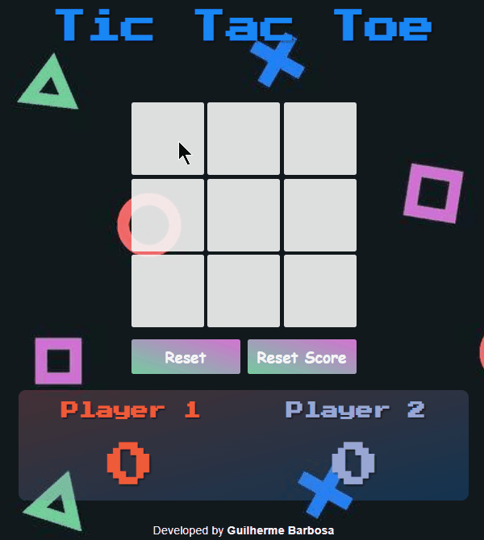
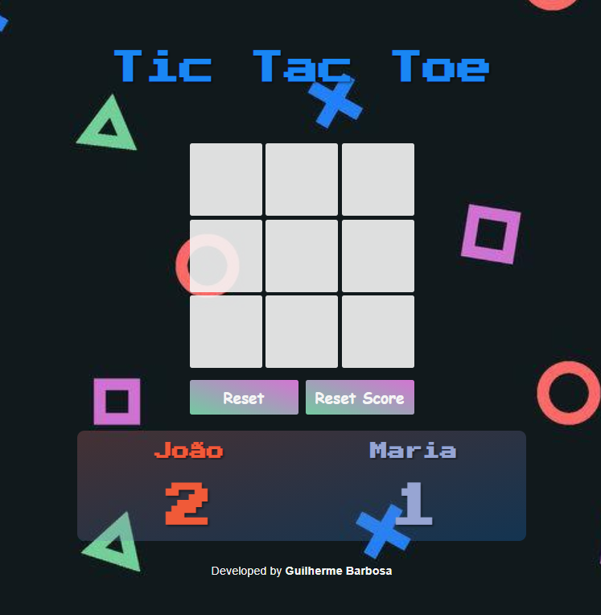

<h4 align="center">
<h1 align="center">🕹️TIC-TAC-TOE 🕹️</h1>

Este foi um projeto desenvolvido durante um curso que realizei, com algumas alterações.

    
    

</h4>

## 🚀 Tecnologias

Este Projeto foi desenvolvido usando as seguintes tecnologias:

- ✔️ HTML5
- ✔️ CSS3
- ✔️ JavaScript

### Pode testar <a href="https://guilherme994.github.io/tic_tac_toe/" target="_blank">clicando aqui</a>.